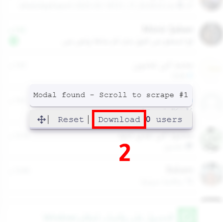

# WhatsApp Number Extractor

A powerful tool to extract phone numbers from WhatsApp groups and export them into a CSV file. This WhatsApp number extractor works directly in your browser, without requiring any extensions or proxies. Simply open WhatsApp web client [https://web.whatsapp.com](https://web.whatsapp.com/), copy-paste the script into your Chrome console, and open the group members modal. Then scroll to extract the phone numbers.

## How to use the WhatsApp Number Extractor

1. Open the [WhatsApp Web Client](https://web.whatsapp.com) on Chrome
2. Open Chrome Developer Console (Ctrl + Shift + I on Windows or Cmd + Option + I on Mac)
3. Copy Paste the script code into the console. It will add a "Download 0 users" button. **Important: Copy/Paste before opening the group members modal**
4. Click on "Group info" and "View all" in the members listing to open the group members modal
5. Scroll to load new users that will get scraped by the script. The button counter increases with new users scraped
6. Scroll several times between the top and the bottom to ensure all members are captured
7. Once the counter stops increasing, click on the "Download X users" button to download the CSV file with phone numbers
8. The extracted numbers are kept in a cache until you click the "Reset" button

## Features

- **Clean Phone Number Export**: Extracts only the phone numbers in a clean format
- **Modern UI**: Enhanced interface with improved colors and styling
- **Developer Information**: Access developer information through the "Info" button
- **Persistent Storage**: Extracted numbers are saved in browser cache until reset

## Extracted Data

- **Phone Number**: Member phone numbers in clean format (without random symbols)

## Screenshots Guide

**Open Chrome Developer Console**

To open the Chrome Developer console on Chrome, use the keyboard shortcut `Ctrl + Shift + I` (on Windows) or `Cmd + Option + I` (on Mac).

**Copy Paste the script**

Select the "Console" tab and copy-paste the script.

**Open the WhatsApp Group Members Modal**

Click on the "Group Info" link and then open the Group Members modal.

**Scroll in the Group Members Modal**

Scroll slowly to the bottom, then slowly back to the top. The members information are loaded as you scroll.

**Export phone numbers in CSV format**

Once finished, click the button "Download X users" to save your CSV file.

## FAQ

- **How to remove the buttons?**
  - Just reload your WhatsApp page. Any javascript code added in Chrome Developer Console will be removed.
- **How many numbers can be extracted?**
  - The script stores the extracted numbers in a database. There is no limit on the number of phone numbers you can extract.
- **What is the "Reset" button?**
  - The phone numbers are stored in a cache in your browser. The "Reset" button clears this cache.
- **Is it free?**
  - Yes, this tool is free to use.

- **GitHub**: [https://github.com/ihsanalapsi](https://github.com/ihsanalapsi)
- **LinkedIn**: [https://www.linkedin.com/in/ihsan-alapsi/](https://www.linkedin.com/in/ihsan-alapsi/)
- **Instagram**: [https://www.instagram.com/ihsan.alapsi/](https://www.instagram.com/ihsan.alapsi/)

© 2025 WhatsApp Number Extractor (Edited) by Ihsan Alapsi
